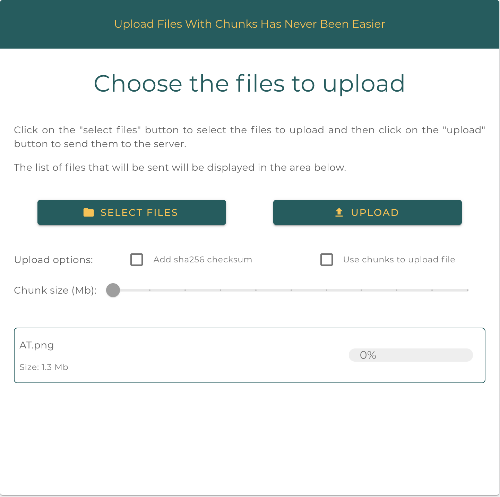
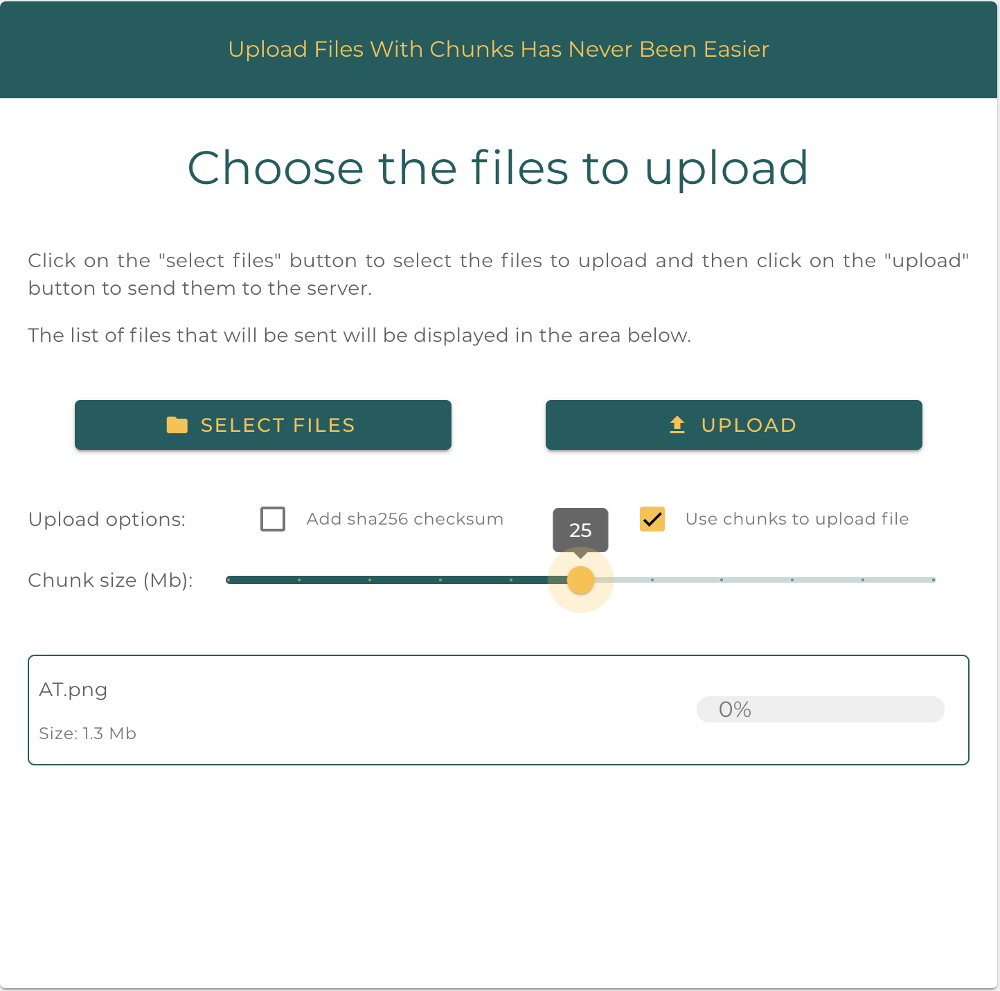
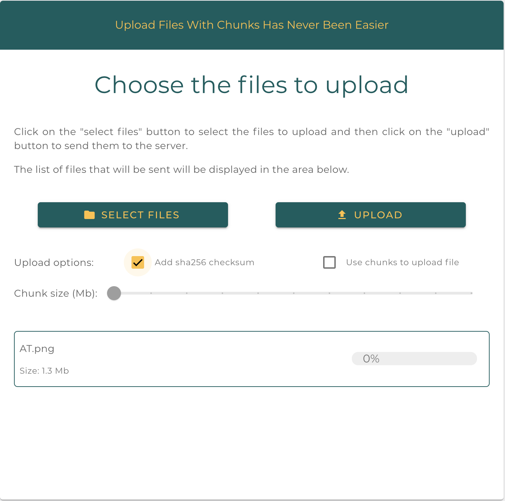
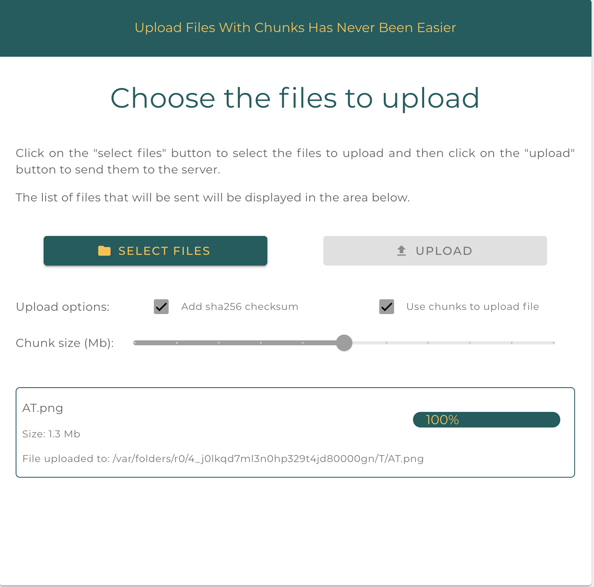
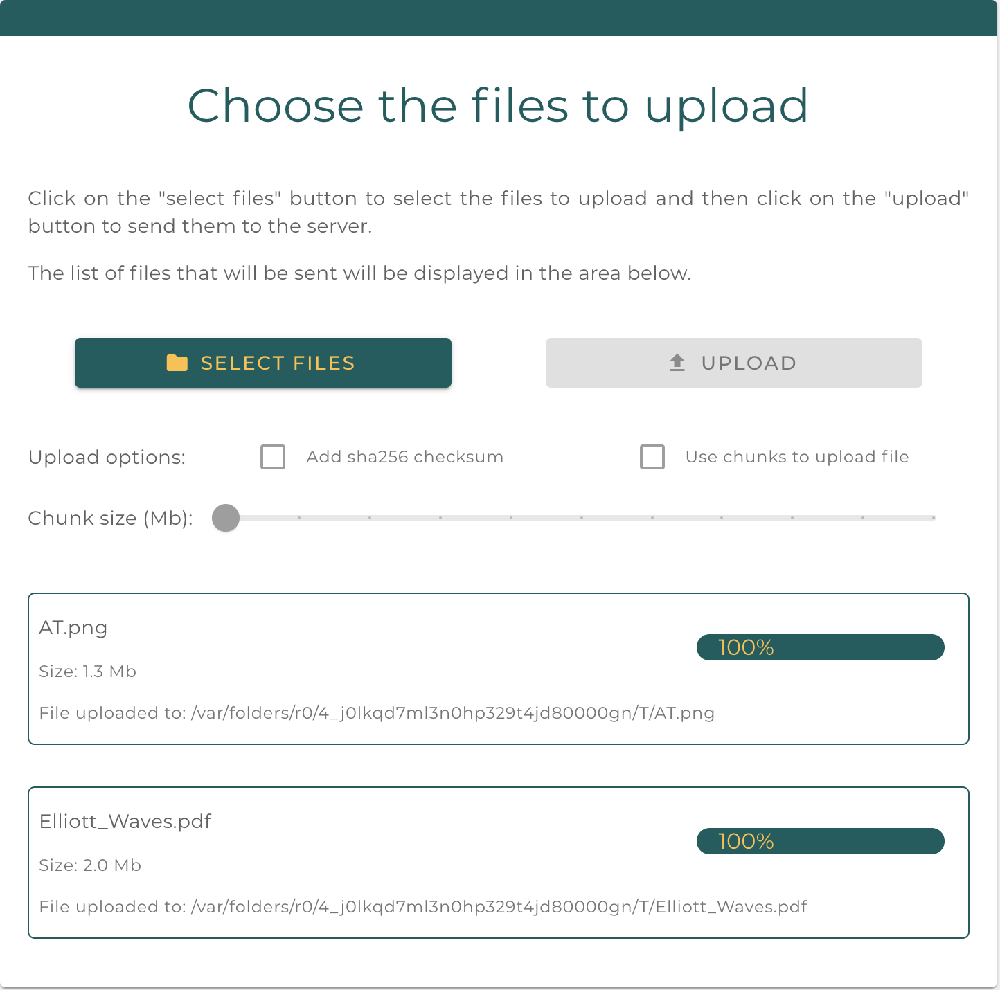

# Upload Files With Chunks

Project to show how to upload a file in the browser and send it fully or in several chunks to the server.

It is an implementation of the ["@akanass/rx-file-upload"](https://github.com/akanass/rx-file-upload) library for the client part and of the ["fastify-multipart"](https://github.com/fastify/fastify-multipart) pluglin for the server part in [NestJS](https://github.com/nestjs/nest).

**NOTE: You must have a recent browser that supports `ESM modules` in order to run the application.**

## Installation

```bash
$ cd path/to/workspace
$ git clone https://github.com/akanass/upload-file-with-chunks.git | git@github.com:akanass/upload-file-with-chunks.git
```

### Local

```bash
# install dependencies
$ yarn install | npm install
```

### Docker

You don't have to do anything more.

## Running the app

Once launched, the application will run on port **3000**.

### Local

```bash
# build
$ {yarn|npm} run build

# production mode
$ {yarn|npm} run start:prod
```

### Docker

```bash
$ docker compose up -d
```

## Configuration

You can change the configuration in [default config file](https://github.com/akanass/upload-file-with-chunks/blob/master/config/default.yml#L54).

If for example you want to use your **own API** to receive the files you need to change the `upload.api.fileEndpoint` value to `"http://mon-api.com"`.

Each time you change a configuration data, you will have to restart the application for the changes to be taken into account.

### Local

```bash
# relaunch production mode
$ {yarn|npm} run start:prod
```

### Docker

```bash
$ docker compose up --build -d
```

## Application in details

Once your application is launched, you will first need to select the file to upload to your API:


Once selected, you can choose upload options:



If you choose to upload your files into **chunks**, you will be able to choose the **size** of each chunk using the associated **slider**.

If the value is equal to `0` then the default value of `1Mb` will be taken into account.



The second possible option is to add a sha256 encoded checksum for each file.

However, you should know that the larger the file, the longer the generation time will be, which will cause a delay before sending it to the API.



Finally, you just have to click on the upload button and enjoy the magic of the library that will do everything for you:



If you use **our API** to upload your files, the destination path will be indicated as you can see in the screenshot.

In the case of using the application in **Docker**, the files will be uploaded to the mounted directory `docker_tmp_upload` which is at the **root** of this project.

And of course, multiple file uploads are taken into account by the library:



## Implementation

If you want to see how the **client** implementation is going you can go [here](https://github.com/akanass/upload-file-with-chunks/blob/master/src_client/ts/upload.ts) and for the **server** implementation [here](https://github.com/akanass/upload-file-with-chunks/blob/master/src/api/api.controller.ts).

## License

This project is [MIT licensed](LICENSE).
